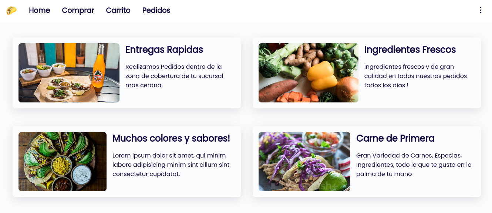

# Taqueria

This is a simple ui concep for a taco shop :D.

## Run locally

- clone this repo.

- run the following command inside this project:

  `npm run start`

- An alternative you can use any vs code extension or http server to run this locally.

## How Dark mode works

For this tiny project i have implemented easily the dark mode, using only one javascript function to toggle the theme, and some css code.

- For this we have to know the css color-scheme property. This feature changes the inputs accent color, font color and background color of the whole document or in a specific element, this css property just accepts two values, light or dark

- example:

```css
* {
  color-scheme: dark;
}
```

TODO:complete the dark mode explanation

## ScreenShots

Home Page


Buy Form

