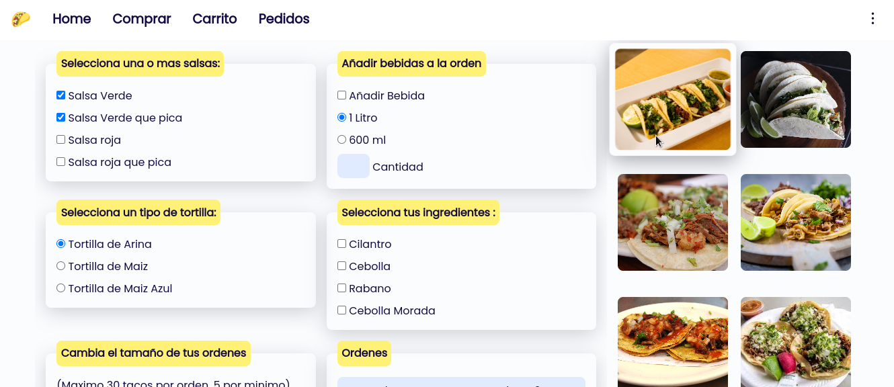

# Taqueria

This is a simple ui concep for a taco shop :D.

## Run locally

- clone this repo.

- run the following command inside this project:

  `npm run start`

- An alternative you can use any vs code extension or http server to run this locally.

## ScreenShots

Home Page

Buy Form

